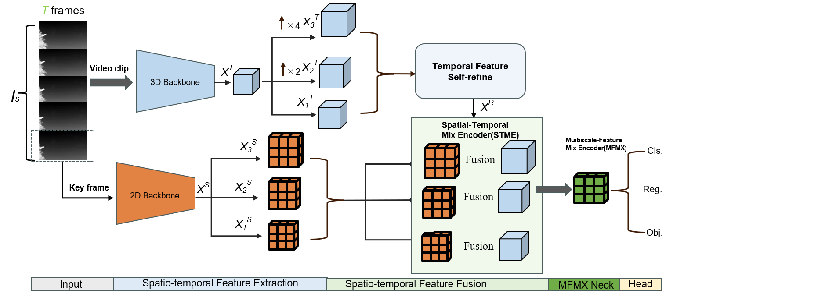

# SMFNet
The Pytorch implementation of the our paper of UESTC-nnLab [**A Simple and Effective Multi-Scale Time Fusion Network for Moving Infrared Dim-small Target Detectio**]

## Abstract
The detection of infrared and dim-small target has become a challenging and hot topic in recent years. However, due to  the extremely small pixels and low intensity of infrared dim target, the existing methods based on single frame does not consider the temporal relationship between frames, thus resulting in poor performance in  detecting infrared moving objects. The current state-of-the-art (SOTA) methods, i.e.,SSTNet primarily relies on an improved ConvLSTM to aggregate features from adjacent frames, while this method implicit utilize temporal information by a pseudo-supervised and  fails to sufficiently integrate both spatial and temporal information. Furthermore, the ConvLSTM's high computational complexity leads to substantial GPU memory occupancy during training. In this paper, we propose  a Simple and Effective Multi-Scale Temporal Fusion Network based on Spatio-Temporal Feature Fusion. Specifically,  in the multi-scale spatial-temporal feature extraction module,  the efficient 3D backbone and 2D backbone  is introduced to extract  temporal information from the whole video clip and spatial information from the key frame separately. Then, the self-refine module adaptively adjust the extracted temporal feature by the means of spatial and temporal attention.  In addition, to better fuse this two type of feature, we adopt convolutional feature fusion techniques complemented with channel-wise self-attention mechanisms for adaptive calibration at different scale. Extensive experimentation validates that this method simple yet  SOTA on various infrared datasets including IRDST and ITDST, without any bells and whistles,  our method reduces FLOPs by approximately 65.98\%, offers faster inference speeds , and achieves higher accuracy compared with SSTNet.

## Results

- PR curve on DAUB and IRDST datasets.
- We provide the results on [ITSDT-15K](./readme/ITDST_results) and [IRDST](./readme/IRDST_results), and you can plot them using Python.

